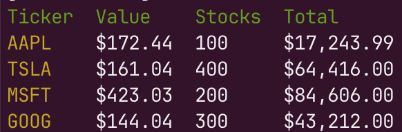

# My Stocks

Simple CLI tool for displaying the real time value of your current stocks based on the tickets
and number of stocks.

# Configuration

Open the `tickets.yml` file and add your stocks tickets and number of stocks.

YAML configuration file example:

```yaml
tickets:
  - ticket: AAPL
    stocks: 1
  - ticket: MSFT
    stocks: 2
  - ticket: GOOG
    stocks: 3
  - ticket: TSLA
    stocks: 4
```

# Usage

```
./mystocks
```

The following screenshot displays the result:



# Compiling

```
make build
```
